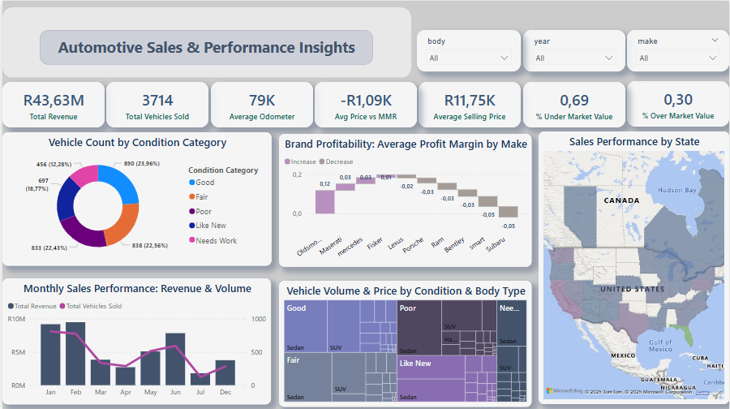

# Vehicle Sales Performance Dashboard & ETL Pipeline

## 1. Project Overview & Motivation

This project showcases an end-to-end data analytics pipeline, transforming raw vehicle sales data into actionable business insights through an interactive Power BI dashboard. It highlights a comprehensive workflow, from initial data cleaning and preprocessing using Python, to robust data storage and complex transformations with SQL Server, culminating in dynamic visualization.

**Motivation:**
In the competitive automotive market, understanding granular sales performance, identifying profitable segments, and tracking market trends are crucial for strategic decision-making and optimizing operations. This project was undertaken to build a comprehensive analytical tool that addresses key business questions and provides immediate insights, demonstrating proficiency in a full data analytics stack.

Through this hands-on project, I also focused on **upskilling and reinforcing my abilities** in critical areas such as robust data quality management, advanced SQL querying for complex data manipulation, effective data modeling principles, and the creation of highly interactive and visually compelling dashboards in Power BI. This continuous learning approach ensures a holistic understanding of data from source to insight.

## 2. Data Source & Initial Exploration

The raw dataset for this project was sourced from [Kaggle: Vehicle Sales Data](https://www.kaggle.com/datasets/syedanwarafridi/vehicle-sales-data). This dataset provides a detailed historical record of vehicle auction sales.

**Initial Data Overview:**
Upon initial inspection, the dataset comprised approximately 500,000 rows and 15 columns, containing rich transactional details such as vehicle specifications (`year`, `make`, `model`, `body`), sales metrics (`sellingprice`, `mmr`, `saledate`), and logistical information (`state`, `condition`, `odometer`, `seller`). Preliminary data profiling revealed the presence of missing values, particularly in critical columns, and identified the need for rigorous data type conversions, especially for `saledate`, to ensure data integrity and usability for time-series analysis.

---
# Vehicle Sales Performance Dashboard & ETL Pipeline

## 1. Project Overview & Motivation

This project showcases an end-to-end data analytics pipeline, transforming raw vehicle sales data into actionable business insights through an interactive Power BI dashboard. It highlights a comprehensive workflow, from initial data cleaning and preprocessing using Python, to robust data storage and complex transformations with SQL Server, culminating in dynamic visualization.

**Motivation:**
In the competitive automotive market, understanding granular sales performance, identifying profitable segments, and tracking market trends are crucial for strategic decision-making and optimizing operations. This project was undertaken to build a comprehensive analytical tool that addresses key business questions and provides immediate insights, demonstrating proficiency in a full data analytics stack.

Through this hands-on project, I also focused on **upskilling and reinforcing my abilities** in critical areas such as robust data quality management, advanced SQL querying for complex data manipulation, effective data modeling principles, and the creation of highly interactive and visually compelling dashboards in Power BI. This continuous learning approach ensures a holistic understanding of data from source to insight.

## 2. Data Source & Initial Exploration

The raw dataset for this project was sourced from [Kaggle: Vehicle Sales Data](https://www.kaggle.com/datasets/syedanwarafridi/vehicle-sales-data). This dataset provides a detailed historical record of vehicle auction sales.

**Initial Data Overview:**
Upon initial inspection, the dataset comprised approximately 500,000 rows and 15 columns, containing rich transactional details such as vehicle specifications (`year`, `make`, `model`, `body`), sales metrics (`sellingprice`, `mmr`, `saledate`), and logistical information (`state`, `condition`, `odometer`, `seller`). Preliminary data profiling revealed the presence of missing values, particularly in critical columns, and identified the need for rigorous data type conversions, especially for `saledate`, to ensure data integrity and usability for time-series analysis.

## 3. Technical Workflow & Technologies

This project follows a structured ETL (Extract, Transform, Load) approach, leveraging a suite of tools for each stage of the data pipeline.

**Tools and Technologies Used:**
* **Python:** For initial data cleaning and preprocessing.
    * Libraries: `pandas`
    * Environment: `VS Code`
* **SQL:** For data storage, management, and advanced transformations.
    * Database: `SQL Server`
* **Power BI Desktop:** For data modeling, DAX measure creation, and interactive dashboard visualization.
    * Language: `DAX`
* **Excel:** Used for initial data browsing and quick checks.
* **AI (Generative AI):** Utilized for accelerating development and generating detailed explanations (e.g., for code snippets, documentation).

### A. Data Cleaning & Preprocessing (Python)

**Purpose:** The primary goal of this Python stage was to ensure the raw data was clean, consistent, and correctly formatted, making it suitable for import into a relational database and subsequent analysis. This involved addressing common data quality issues that could impede accurate insights.

**Key Operations Performed:**
The `data_cleaning.py` script performs the following critical steps:
* **Data Loading:** Reads the `car_prices.csv` file into a pandas DataFrame.
* **Initial Data Overview:** Prints shape, columns, data types, and null counts to quickly assess data quality and structure.
* **Robust Date Conversion:** Converts the `saledate` column to datetime objects using `format='mixed'` for flexibility and `utc=True` for consistent timezone handling. `errors='coerce'` is used to convert any unparseable dates into `NaT` (Not a Time), preventing script crashes.
* **Handling Missing Key Data:** Drops rows where `saledate`, `sellingprice`, or `mmr` are missing, as these are fundamental for sales analysis.
* **Feature Engineering:** Creates new calculated columns essential for the dashboard:
    * `price_diff`: The difference between `sellingprice` and `mmr` (market value).
    * `profit_margin`: The percentage profit margin, calculated as `price_diff` divided by `mmr`, rounded to two decimal places.
    * `sale_year` and `sale_month`: Extracted from `saledate` for time-based analysis.
* **Final Verification:** Prints a sample of the cleaned data and its data types to confirm the transformations.
* **Export:** Saves the cleaned and transformed data to a new CSV file, `clean_vehicle_sales.csv`, ready for SQL import.

### B. Data Storage & Transformation (SQL Server)

**Purpose:** SQL Server was chosen for its robust capabilities in managing large datasets and performing complex, efficient data transformations. This stage prepared the data into specific aggregated views and refined structures, making it highly optimized for consumption by Power BI.

**Key Operations Performed (SQL Queries):**
The `SQLforVehicle.sql` script contains a series of queries designed to pre-process and aggregate the cleaned data for direct use in Power BI visuals. This approach offloads heavy computation from Power BI to the database, improving dashboard performance.
* **Monthly Sales Trend:** Aggregates sales data by month, calculating `total_vehicles_sold`, `total_revenue`, and `avg_price`.
    ```sql
    -- Monthly Sales Trend
    SELECT
        CONVERT(VARCHAR(7), saledate, 120) AS sale_month,
        COUNT(*) AS total_vehicles_sold,
        SUM(CAST(sellingprice AS DECIMAL(18,2))) AS total_revenue,
        ROUND(AVG(CAST(sellingprice AS DECIMAL(18,2))), 2) AS avg_price
    FROM clean_vehicle_sales
    WHERE saledate IS NOT NULL
        AND TRY_CAST(sellingprice AS DECIMAL(18,2)) IS NOT NULL
    GROUP BY CONVERT(VARCHAR(7), saledate, 120)
    ORDER BY sale_month;
    ```
* **Top 10 Brands by Revenue and Volume:** Identifies leading brands based on sales volume and revenue.
    ```sql
    -- Top 10 Brands by Revenue and Volume
    SELECT TOP 10
        make,
        COUNT(*) AS total_sold,
        ROUND(SUM(CAST(sellingprice AS DECIMAL(18,2))), 0) AS total_sales,
        ROUND(AVG(CAST(sellingprice AS DECIMAL(18,2))), 0) AS avg_price
    FROM clean_vehicle_sales
    WHERE make IS NOT NULL
        AND TRY_CAST(sellingprice AS DECIMAL(18,2)) IS NOT NULL
    GROUP BY make
    ORDER BY total_sales DESC;
    ```
* **Average Price Gap by Brand:** Calculates the average difference and percentage margin between selling price and market price (`mmr`) for each brand.
    ```sql
    -- Average Price Gap by Brand
    SELECT
        make,
        ROUND(AVG(CAST(sellingprice AS DECIMAL(18,2)) - CAST(mmr AS DECIMAL(18,2))), 2) AS avg_price_diff,
        ROUND(AVG(
            CASE
                WHEN CAST(mmr AS DECIMAL(18,2)) = 0 THEN NULL
                ELSE (CAST(sellingprice AS DECIMAL(18,2)) - CAST(mmr AS DECIMAL(18,2))) /
                     CAST(mmr AS DECIMAL(18,2))
            END
        ), 2) AS avg_margin_pct
    FROM clean_vehicle_sales
    WHERE mmr IS NOT NULL
        AND sellingprice IS NOT NULL
        AND TRY_CAST(sellingprice AS DECIMAL(18,2)) IS NOT NULL
        AND TRY_CAST(mmr AS DECIMAL(18,2)) IS NOT NULL
    GROUP BY make
    ORDER BY avg_price_diff DESC;
    ```
* **Condition Based Pricing:** Analyzes sales metrics (count, average selling price, average MMR, average price difference) grouped by vehicle condition.
    ```sql
    -- Condition Based Pricing
    SELECT
        condition,
        COUNT(*) AS vehicle_count,
        ROUND(AVG(CAST(sellingprice AS DECIMAL(18,2))), 0) AS avg_selling_price,
        ROUND(AVG(CAST(mmr AS DECIMAL(18,2))), 0) AS avg_mmr,
        ROUND(AVG(CAST(sellingprice AS DECIMAL(18,2)) - CAST(mmr AS DECIMAL(18,2))), 0) AS avg_price_difference
    FROM clean_vehicle_sales
    WHERE condition IS NOT NULL
        AND TRY_CAST(sellingprice AS DECIMAL(18,2)) IS NOT NULL
        AND TRY_CAST(mmr AS DECIMAL(18,2)) IS NOT NULL
    GROUP BY condition
    ORDER BY avg_selling_price DESC;
    ```
* **State Level Revenue Breakdown:** Provides a geographical breakdown of sales performance.
    ```sql
    -- State level revenue breakdown
    SELECT
        state,
        COUNT(*) AS vehicles_sold,
        SUM(CAST(sellingprice AS DECIMAL(18,2))) AS total_revenue,
        ROUND(AVG(CAST(sellingprice AS DECIMAL(18,2))), 0) AS avg_price,
        ROUND(AVG(CAST(sellingprice AS DECIMAL(18,2)) - CAST(mmr AS DECIMAL(18,2))), 0) AS avg_price_vs_mmr
    FROM clean_vehicle_sales
    WHERE state IS NOT NULL
        AND TRY_CAST(sellingprice AS DECIMAL(18,2)) IS NOT NULL
        AND TRY_CAST(mmr AS DECIMAL(18,2)) IS NOT NULL
    GROUP BY state
    ORDER BY total_revenue DESC;
    ```
* **Transmission Type Trends:** Examines sales and pricing trends based on transmission type.
    ```sql
    -- Transmission Type Trends
    SELECT
        transmission,
        COUNT(*) AS total_sold,
        ROUND(AVG(CAST(sellingprice AS DECIMAL(18,2))), 0) AS avg_price,
        ROUND(AVG(CAST(sellingprice AS DECIMAL(18,2)) - CAST(mmr AS DECIMAL(18,2))), 0) AS avg_price_vs_market,
        COUNT(DISTINCT model) AS unique_models_available
    FROM clean_vehicle_sales
    WHERE transmission IS NOT NULL
        AND TRY_CAST(sellingprice AS DECIMAL(18,2)) IS NOT NULL
        AND TRY_CAST(mmr AS DECIMAL(18,2)) IS NOT NULL
    GROUP BY transmission
    ORDER BY total_sold DESC;
    ```
**Output:** The execution of these SQL queries provides refined, aggregated datasets that are directly consumed by Power BI, ensuring optimal dashboard performance and accurate analytical views. Screenshots of the results from these queries are provided in the `02_Scripts/sql/results_screenshots/` folder.

### C. Data Modeling & Visualization (Power BI Desktop)

**Purpose:** Power BI Desktop was utilized to transform the prepared data into an interactive, user-friendly, and visually compelling dashboard, enabling stakeholders to quickly grasp key sales performance metrics and trends.

**Key Operations Performed:**
* **Data Connection:** Established a direct connection to the transformed data residing in SQL Server, ensuring real-time access to the refined datasets.
* **Data Modeling:** Created a robust data model, including a dedicated `Date Table` (generated in Power BI) and established relationships with the `vehicles` table based on `saledate`. This foundational step enables powerful time-intelligence calculations and hierarchical date analysis within the dashboard.
* **DAX Measures:** Developed a suite of Data Analysis Expressions (DAX) to create key performance indicators (KPIs) and complex analytical calculations, including:
    * `Total Revenue`
    * `Total Vehicles Sold`
    * `Average Odometer`
    * `Avg Price vs MMR`
    * `Average Selling Price`
    * `% Under Market Value`
    * `% Over Market Value`
    * `Avg Profit Margin`
* **Dashboard Design & Visuals:** Designed an intuitive dashboard layout, featuring a prominent title and strategically placed visuals for maximum impact:
    * **7 Key Performance Indicator (KPI) Cards:** Providing an immediate, high-level overview of critical sales metrics. These were meticulously aligned and sized for a clean, professional header.
    * **Donut Chart (`Vehicle Count by Condition Category`):** Visualizing the distribution of vehicles across different condition categories, highlighting the sales mix.
    * **Waterfall Chart (`Brand Profitability: Average Profit Margin by Make`):** Illustrating the contribution of individual vehicle makes to the overall average profit margin, revealing brands selling above or below market price.
    * **Line & Clustered Column Chart (`Monthly Sales Performance: Revenue & Volume`):** Displaying monthly trends for both total revenue and total vehicles sold, allowing for analysis of seasonality and volume-revenue relationships.
    * **Treemap (`Vehicle Volume & Price by Condition & Body Type`):** Showcasing the hierarchical breakdown of sales volume by vehicle condition and body type, with color saturation indicating average selling price.
    * **Filled Map (`Sales Performance by State`):** Providing a geographical overview of sales performance, with states colored by total revenue, identifying regional strengths and areas for focus.
* **Interactivity & User Experience:** Incorporated compact dropdown slicers for `Body Type`, `Year`, and `Make` to enable dynamic filtering across all visuals, empowering users to explore data segments independently.
* **Aesthetics:** Applied consistent formatting, color palettes, and precise alignment across all visuals to ensure a clean, professional, and visually appealing dashboard.

## 4. Dashboard & Insights

### Final Dashboard Preview

Below is a high-resolution screenshot of the complete interactive dashboard, showcasing the culmination of the data analytics pipeline.



### Key Insights from the Dashboard

Based on the interactive dashboard, several key insights into vehicle sales performance can be derived:

* **Overall Performance at a Glance:** The top-level KPIs immediately highlight `Total Revenue` of R43.63M and `3714 Total Vehicles Sold`, providing a quick snapshot of the business scale. The `Average Odometer` of 79K suggests a market leaning towards used vehicles.
* **Profitability by Brand:** The Waterfall chart distinctly shows that brands like 'Oldsmobile' and 'Maserati' are contributing positively to the average profit margin, selling above market price, while brands like 'Subaru' and 'Smart' are selling below market price, indicating areas for strategic review or pricing adjustments.
* **Sales Mix & Condition:** The Donut chart reveals that 'Good' and 'Needs Work' conditions account for the largest segments of vehicles sold, suggesting a diverse market for both well-maintained and project vehicles. The Treemap further breaks this down by body type, showing the prevalence of 'Sedan' and 'SUV' within various conditions.
* **Monthly Sales Trends:** The combined Line and Clustered Column chart illustrates monthly fluctuations in both revenue and volume. While specific seasonality can be observed (e.g., a dip in July, a rebound in December), the overall trend provides a basis for forecasting and resource allocation.
* **Geographical Concentration:** The Filled Map clearly indicates that sales are heavily concentrated in the United States, with certain states showing higher revenue saturation, highlighting key operational regions and potential expansion opportunities.
* **Market Value Analysis:** The 'Avg Price vs MMR' KPI (-R1.09K) and the '% Under Market Value' (0.69) and '% Over Market Value' (0.30) metrics suggest that, on average, vehicles are selling slightly below the market reference price, indicating competitive pricing or market conditions.

---

## 5. Repository Structure & How to Use

This repository is structured to provide a clear, end-to-end view of the data analytics project, allowing for easy navigation and replication of the workflow.

### Repository Structure

Excellent! I have all the information needed to complete the README.md now. This is a very comprehensive project structure, and the inclusion of SQL results screenshots is a great touch for your portfolio.
Here's the continuation of your README.md file, incorporating all your details and my elaborations for the Power BI section, Key Insights, and Repository structure.
Markdown
# Vehicle Sales Performance Dashboard & ETL Pipeline

## 1. Project Overview & Motivation

This project showcases an end-to-end data analytics pipeline, transforming raw vehicle sales data into actionable business insights through an interactive Power BI dashboard. It highlights a comprehensive workflow, from initial data cleaning and preprocessing using Python, to robust data storage and complex transformations with SQL Server, culminating in dynamic visualization.

**Motivation:**
In the competitive automotive market, understanding granular sales performance, identifying profitable segments, and tracking market trends are crucial for strategic decision-making and optimizing operations. This project was undertaken to build a comprehensive analytical tool that addresses key business questions and provides immediate insights, demonstrating proficiency in a full data analytics stack.

Through this hands-on project, I also focused on **upskilling and reinforcing my abilities** in critical areas such as robust data quality management, advanced SQL querying for complex data manipulation, effective data modeling principles, and the creation of highly interactive and visually compelling dashboards in Power BI. This continuous learning approach ensures a holistic understanding of data from source to insight.

## 2. Data Source & Initial Exploration

The raw dataset for this project was sourced from [Kaggle: Vehicle Sales Data](https://www.kaggle.com/datasets/syedanwarafridi/vehicle-sales-data). This dataset provides a detailed historical record of vehicle auction sales.

**Initial Data Overview:**
Upon initial inspection, the dataset comprised approximately 500,000 rows and 15 columns, containing rich transactional details such as vehicle specifications (`year`, `make`, `model`, `body`), sales metrics (`sellingprice`, `mmr`, `saledate`), and logistical information (`state`, `condition`, `odometer`, `seller`). Preliminary data profiling revealed the presence of missing values, particularly in critical columns, and identified the need for rigorous data type conversions, especially for `saledate`, to ensure data integrity and usability for time-series analysis.

## 3. Technical Workflow & Technologies

This project follows a structured ETL (Extract, Transform, Load) approach, leveraging a suite of tools for each stage of the data pipeline.

**Tools and Technologies Used:**
* **Python:** For initial data cleaning and preprocessing.
    * Libraries: `pandas`
    * Environment: `VS Code`
* **SQL:** For data storage, management, and advanced transformations.
    * Database: `SQL Server`
* **Power BI Desktop:** For data modeling, DAX measure creation, and interactive dashboard visualization.
    * Language: `DAX`
* **Excel:** Used for initial data browsing and quick checks.
* **AI (Generative AI):** Utilized for accelerating development and generating detailed explanations (e.g., for code snippets, documentation).

### A. Data Cleaning & Preprocessing (Python)

**Purpose:** The primary goal of this Python stage was to ensure the raw data was clean, consistent, and correctly formatted, making it suitable for import into a relational database and subsequent analysis. This involved addressing common data quality issues that could impede accurate insights.

**Key Operations Performed:**
The `data_cleaning.py` script performs the following critical steps:
* **Data Loading:** Reads the `car_prices.csv` file into a pandas DataFrame.
* **Initial Data Overview:** Prints shape, columns, data types, and null counts to quickly assess data quality and structure.
* **Robust Date Conversion:** Converts the `saledate` column to datetime objects using `format='mixed'` for flexibility and `utc=True` for consistent timezone handling. `errors='coerce'` is used to convert any unparseable dates into `NaT` (Not a Time), preventing script crashes.
* **Handling Missing Key Data:** Drops rows where `saledate`, `sellingprice`, or `mmr` are missing, as these are fundamental for sales analysis.
* **Feature Engineering:** Creates new calculated columns essential for the dashboard:
    * `price_diff`: The difference between `sellingprice` and `mmr` (market value).
    * `profit_margin`: The percentage profit margin, calculated as `price_diff` divided by `mmr`, rounded to two decimal places.
    * `sale_year` and `sale_month`: Extracted from `saledate` for time-based analysis.
* **Final Verification:** Prints a sample of the cleaned data and its data types to confirm the transformations.
* **Export:** Saves the cleaned and transformed data to a new CSV file, `clean_vehicle_sales.csv`, ready for SQL import.

### B. Data Storage & Transformation (SQL Server)

**Purpose:** SQL Server was chosen for its robust capabilities in managing large datasets and performing complex, efficient data transformations. This stage prepared the data into specific aggregated views and refined structures, making it highly optimized for consumption by Power BI.

**Key Operations Performed (SQL Queries):**
The `SQLforVehicle.sql` script contains a series of queries designed to pre-process and aggregate the cleaned data for direct use in Power BI visuals. This approach offloads heavy computation from Power BI to the database, improving dashboard performance.
* **Monthly Sales Trend:** Aggregates sales data by month, calculating `total_vehicles_sold`, `total_revenue`, and `avg_price`.
    ```sql
    -- Monthly Sales Trend
    SELECT
        CONVERT(VARCHAR(7), saledate, 120) AS sale_month,
        COUNT(*) AS total_vehicles_sold,
        SUM(CAST(sellingprice AS DECIMAL(18,2))) AS total_revenue,
        ROUND(AVG(CAST(sellingprice AS DECIMAL(18,2))), 2) AS avg_price
    FROM clean_vehicle_sales
    WHERE saledate IS NOT NULL
        AND TRY_CAST(sellingprice AS DECIMAL(18,2)) IS NOT NULL
    GROUP BY CONVERT(VARCHAR(7), saledate, 120)
    ORDER BY sale_month;
    ```
* **Top 10 Brands by Revenue and Volume:** Identifies leading brands based on sales volume and revenue.
    ```sql
    -- Top 10 Brands by Revenue and Volume
    SELECT TOP 10
        make,
        COUNT(*) AS total_sold,
        ROUND(SUM(CAST(sellingprice AS DECIMAL(18,2))), 0) AS total_sales,
        ROUND(AVG(CAST(sellingprice AS DECIMAL(18,2))), 0) AS avg_price
    FROM clean_vehicle_sales
    WHERE make IS NOT NULL
        AND TRY_CAST(sellingprice AS DECIMAL(18,2)) IS NOT NULL
    GROUP BY make
    ORDER BY total_sales DESC;
    ```
* **Average Price Gap by Brand:** Calculates the average difference and percentage margin between selling price and market price (`mmr`) for each brand.
    ```sql
    -- Average Price Gap by Brand
    SELECT
        make,
        ROUND(AVG(CAST(sellingprice AS DECIMAL(18,2)) - CAST(mmr AS DECIMAL(18,2))), 2) AS avg_price_diff,
        ROUND(AVG(
            CASE
                WHEN CAST(mmr AS DECIMAL(18,2)) = 0 THEN NULL
                ELSE (CAST(sellingprice AS DECIMAL(18,2)) - CAST(mmr AS DECIMAL(18,2))) /
                     CAST(mmr AS DECIMAL(18,2))
            END
        ), 2) AS avg_margin_pct
    FROM clean_vehicle_sales
    WHERE mmr IS NOT NULL
        AND sellingprice IS NOT NULL
        AND TRY_CAST(sellingprice AS DECIMAL(18,2)) IS NOT NULL
        AND TRY_CAST(mmr AS DECIMAL(18,2)) IS NOT NULL
    GROUP BY make
    ORDER BY avg_price_diff DESC;
    ```
* **Condition Based Pricing:** Analyzes sales metrics (count, average selling price, average MMR, average price difference) grouped by vehicle condition.
    ```sql
    -- Condition Based Pricing
    SELECT
        condition,
        COUNT(*) AS vehicle_count,
        ROUND(AVG(CAST(sellingprice AS DECIMAL(18,2))), 0) AS avg_selling_price,
        ROUND(AVG(CAST(mmr AS DECIMAL(18,2))), 0) AS avg_mmr,
        ROUND(AVG(CAST(sellingprice AS DECIMAL(18,2)) - CAST(mmr AS DECIMAL(18,2))), 0) AS avg_price_difference
    FROM clean_vehicle_sales
    WHERE condition IS NOT NULL
        AND TRY_CAST(sellingprice AS DECIMAL(18,2)) IS NOT NULL
        AND TRY_CAST(mmr AS DECIMAL(18,2)) IS NOT NULL
    GROUP BY condition
    ORDER BY avg_selling_price DESC;
    ```
* **State Level Revenue Breakdown:** Provides a geographical breakdown of sales performance.
    ```sql
    -- State level revenue breakdown
    SELECT
        state,
        COUNT(*) AS vehicles_sold,
        SUM(CAST(sellingprice AS DECIMAL(18,2))) AS total_revenue,
        ROUND(AVG(CAST(sellingprice AS DECIMAL(18,2))), 0) AS avg_price,
        ROUND(AVG(CAST(sellingprice AS DECIMAL(18,2)) - CAST(mmr AS DECIMAL(18,2))), 0) AS avg_price_vs_mmr
    FROM clean_vehicle_sales
    WHERE state IS NOT NULL
        AND TRY_CAST(sellingprice AS DECIMAL(18,2)) IS NOT NULL
        AND TRY_CAST(mmr AS DECIMAL(18,2)) IS NOT NULL
    GROUP BY state
    ORDER BY total_revenue DESC;
    ```
* **Transmission Type Trends:** Examines sales and pricing trends based on transmission type.
    ```sql
    -- Transmission Type Trends
    SELECT
        transmission,
        COUNT(*) AS total_sold,
        ROUND(AVG(CAST(sellingprice AS DECIMAL(18,2))), 0) AS avg_price,
        ROUND(AVG(CAST(sellingprice AS DECIMAL(18,2)) - CAST(mmr AS DECIMAL(18,2))), 0) AS avg_price_vs_market,
        COUNT(DISTINCT model) AS unique_models_available
    FROM clean_vehicle_sales
    WHERE transmission IS NOT NULL
        AND TRY_CAST(sellingprice AS DECIMAL(18,2)) IS NOT NULL
        AND TRY_CAST(mmr AS DECIMAL(18,2)) IS NOT NULL
    GROUP BY transmission
    ORDER BY total_sold DESC;
    ```
**Output:** The execution of these SQL queries provides refined, aggregated datasets that are directly consumed by Power BI, ensuring optimal dashboard performance and accurate analytical views. Screenshots of the results from these queries are provided in the `02_Scripts/sql/results_screenshots/` folder.

### C. Data Modeling & Visualization (Power BI Desktop)

**Purpose:** Power BI Desktop was utilized to transform the prepared data into an interactive, user-friendly, and visually compelling dashboard, enabling stakeholders to quickly grasp key sales performance metrics and trends.

**Key Operations Performed:**
* **Data Connection:** Established a direct connection to the transformed data residing in SQL Server, ensuring real-time access to the refined datasets.
* **Data Modeling:** Created a robust data model, including a dedicated `Date Table` (generated in Power BI) and established relationships with the `vehicles` table based on `saledate`. This foundational step enables powerful time-intelligence calculations and hierarchical date analysis within the dashboard.
* **DAX Measures:** Developed a suite of Data Analysis Expressions (DAX) to create key performance indicators (KPIs) and complex analytical calculations, including:
    * `Total Revenue`
    * `Total Vehicles Sold`
    * `Average Odometer`
    * `Avg Price vs MMR`
    * `Average Selling Price`
    * `% Under Market Value`
    * `% Over Market Value`
    * `Avg Profit Margin`
* **Dashboard Design & Visuals:** Designed an intuitive dashboard layout, featuring a prominent title and strategically placed visuals for maximum impact:
    * **7 Key Performance Indicator (KPI) Cards:** Providing an immediate, high-level overview of critical sales metrics. These were meticulously aligned and sized for a clean, professional header.
    * **Donut Chart (`Vehicle Count by Condition Category`):** Visualizing the distribution of vehicles across different condition categories, highlighting the sales mix.
    * **Waterfall Chart (`Brand Profitability: Average Profit Margin by Make`):** Illustrating the contribution of individual vehicle makes to the overall average profit margin, revealing brands selling above or below market price.
    * **Line & Clustered Column Chart (`Monthly Sales Performance: Revenue & Volume`):** Displaying monthly trends for both total revenue and total vehicles sold, allowing for analysis of seasonality and volume-revenue relationships.
    * **Treemap (`Vehicle Volume & Price by Condition & Body Type`):** Showcasing the hierarchical breakdown of sales volume by vehicle condition and body type, with color saturation indicating average selling price.
    * **Filled Map (`Sales Performance by State`):** Providing a geographical overview of sales performance, with states colored by total revenue, identifying regional strengths and areas for focus.
* **Interactivity & User Experience:** Incorporated compact dropdown slicers for `Body Type`, `Year`, and `Make` to enable dynamic filtering across all visuals, empowering users to explore data segments independently.
* **Aesthetics:** Applied consistent formatting, color palettes, and precise alignment across all visuals to ensure a clean, professional, and visually appealing dashboard.

## 4. Dashboard & Insights

### Final Dashboard Preview

Below is a high-resolution screenshot of the complete interactive dashboard, showcasing the culmination of the data analytics pipeline.


### Key Insights from the Dashboard

Based on the interactive dashboard, several key insights into vehicle sales performance can be derived:

* **Overall Performance at a Glance:** The top-level KPIs immediately highlight `Total Revenue` of R43.63M and `3714 Total Vehicles Sold`, providing a quick snapshot of the business scale. The `Average Odometer` of 79K suggests a market leaning towards used vehicles.
* **Profitability by Brand:** The Waterfall chart distinctly shows that brands like 'Oldsmobile' and 'Maserati' are contributing positively to the average profit margin, selling above market price, while brands like 'Subaru' and 'Smart' are selling below market price, indicating areas for strategic review or pricing adjustments.
* **Sales Mix & Condition:** The Donut chart reveals that 'Good' and 'Needs Work' conditions account for the largest segments of vehicles sold, suggesting a diverse market for both well-maintained and project vehicles. The Treemap further breaks this down by body type, showing the prevalence of 'Sedan' and 'SUV' within various conditions.
* **Monthly Sales Trends:** The combined Line and Clustered Column chart illustrates monthly fluctuations in both revenue and volume. While specific seasonality can be observed (e.g., a dip in July, a rebound in December), the overall trend provides a basis for forecasting and resource allocation.
* **Geographical Concentration:** The Filled Map clearly indicates that sales are heavily concentrated in the United States, with certain states showing higher revenue saturation, highlighting key operational regions and potential expansion opportunities.
* **Market Value Analysis:** The 'Avg Price vs MMR' KPI (-R1.09K) and the '% Under Market Value' (0.69) and '% Over Market Value' (0.30) metrics suggest that, on average, vehicles are selling slightly below the market reference price, indicating competitive pricing or market conditions.

---

## 5. Repository Structure & How to Use

This repository is structured to provide a clear, end-to-end view of the data analytics project, allowing for easy navigation and replication of the workflow.

### Repository Structure

Vehicle Sales Performance Dashboard & ETL Pipeline/
├── 01_Data/
│   ├── raw_data/
│   │   └── original_dataset.csv
│   └── cleaned_data/
│       └── cleaned_vehicles_data.csv
├── 02_Scripts/
│   ├── python/
│   │   └── data_cleaning.py
│   ├── sql/
│   │   ├── SQLforVehicle.sql
│   │   └── results_screenshots/
│   │       ├── Monthly Sales Trend.png
│   │       ├── Top 10 Brands by Revenue and Volume.png
│   │       ├── Average Price Gap by Brand.png
│   │       ├── Condition Based Pricing.png
│   │       ├── State level revenue breakdown.png
│   │       └── Transmission Type Trends.png
├── 03_Reports/
│   └── power_bi/
│       ├── VehicleSalesAnalysis.pbix
│       └── vehicle sales.png
├── README.md
├── requirements.txt
└── .gitignore


### How to Run/View the Project To fully explore and replicate this project, please follow these steps: **1. Clone the Repository:** ```bash git clone [https://github.com/your-username/Vehicle-Sales-Performance-Dashboard-ETL-Pipeline.git](https://github.com/your-username/Vehicle-Sales-Performance-Dashboard-ETL-Pipeline.git) cd Vehicle-Sales-Performance-Dashboard-ETL-Pipeline


Data Cleaning & Preprocessing (Python):
•	Ensure Python 3.x is installed on your system.
•	Navigate to the 02_Scripts/python/ directory.
•	Install the required Python libraries: 
Bash
pip install -r requirements.txt
•	Place your original car_prices.csv dataset into the 01_Data/raw_data/ folder.
•	Run the data cleaning script: 
Bash
python data_cleaning.py
This will generate clean_vehicle_sales.csv in the 01_Data/cleaned_data/ folder.
3. Data Storage & Transformation (SQL Server):
•	Set up a SQL Server instance (or another relational database like PostgreSQL, MySQL, etc., adjusting connection strings as needed).
•	Use a SQL client (e.g., SQL Server Management Studio, Azure Data Studio, DBeaver) to connect to your database.
•	Execute the SQL queries found in 02_Scripts/sql/SQLforVehicle.sql. This script contains commands to create tables and load the clean_vehicle_sales.csv data (you may need to adjust the BULK INSERT or COPY command's file path based on your SQL Server setup and data location) and perform the necessary transformations.
4. Data Modeling & Visualization (Power BI Desktop):
•	Download and install Power BI Desktop.
•	Open the Power BI report file: 03_Reports/power_bi/VehicleSalesAnalysis.pbix.
•	Refresh Data Source: Upon opening, Power BI may prompt you to refresh data. Ensure your SQL Server instance is running and accessible. You may need to update the data source settings in Power BI to point to your specific SQL Server instance and database credentials.
•	Explore the interactive dashboard, utilize the slicers, and hover over visuals to discover detailed insights.
<!-- end list -->

## 6. Conclusion

This project provides a comprehensive analysis of vehicle sales performance, leveraging Python for data cleaning and preprocessing, SQL Server for data storage and transformation, and Power BI for data modeling and visualization. By following the steps outlined in the repository, you can replicate the end-to-end workflow and gain valuable insights into vehicle sales trends, pricing strategies, and market performance.